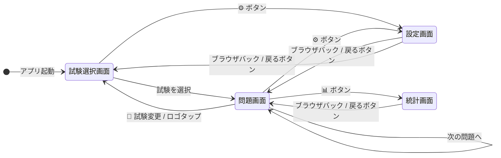
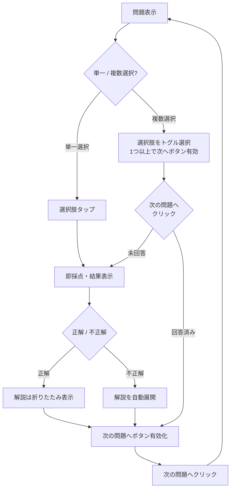
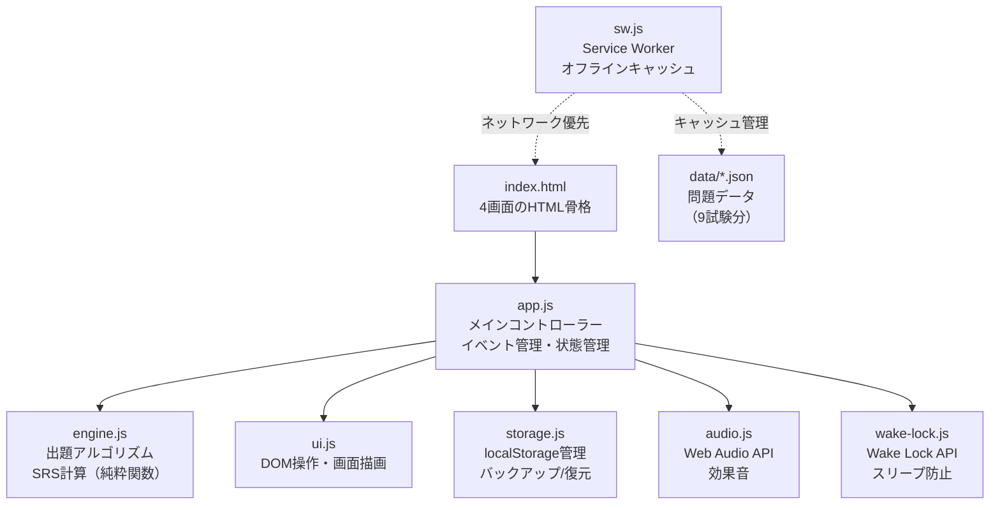
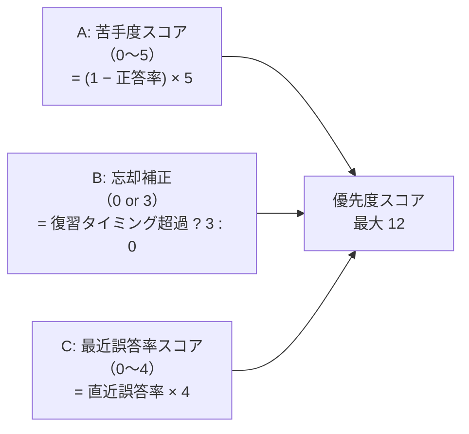
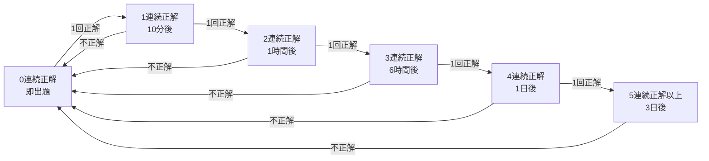
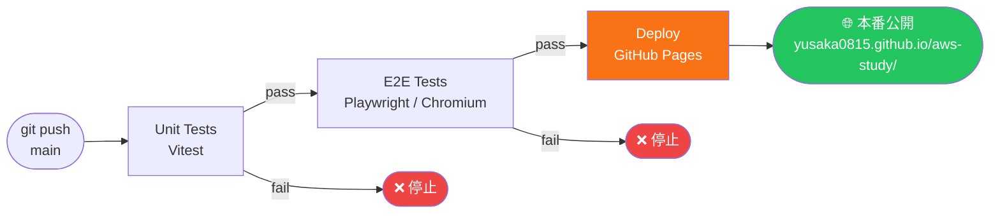
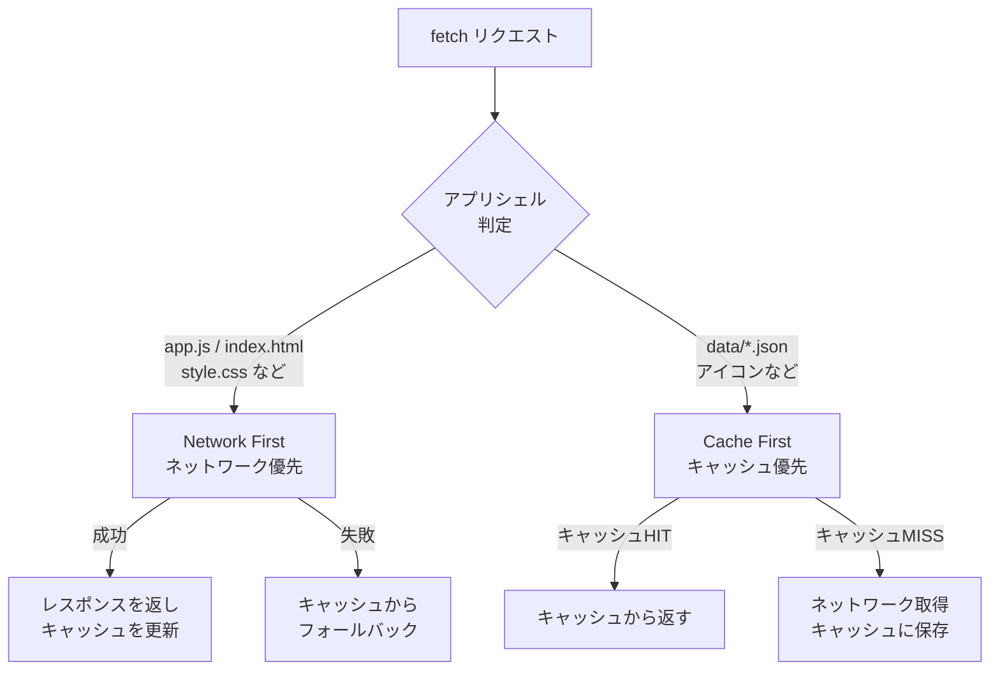
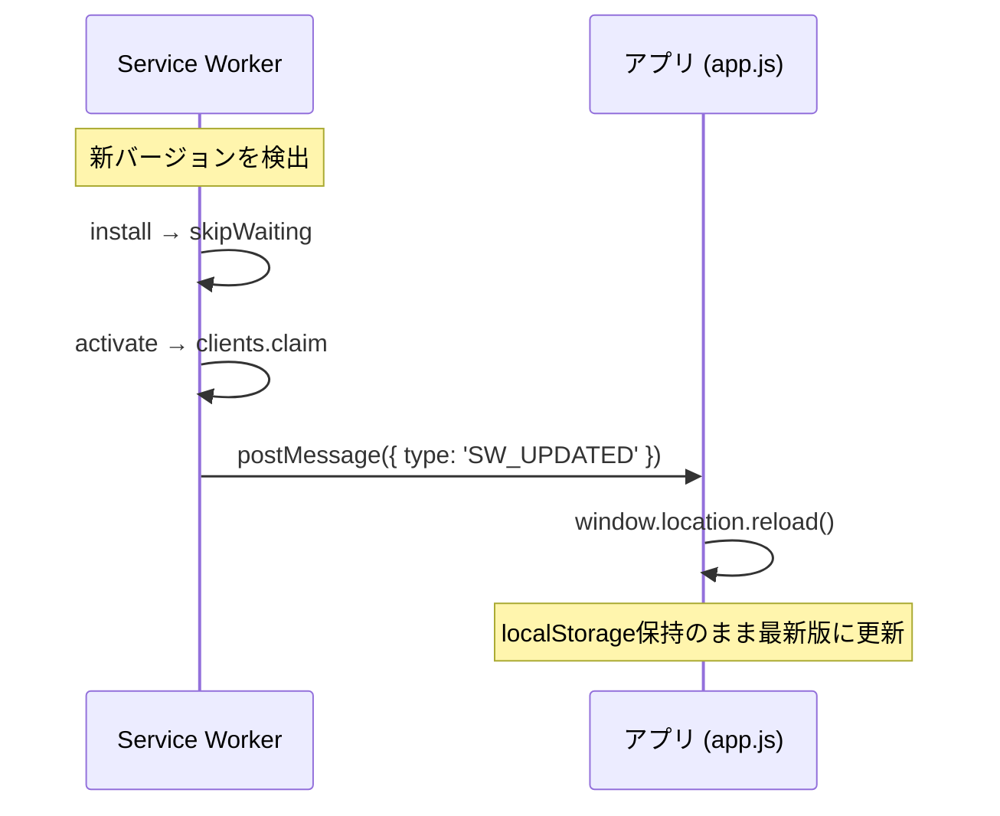

# ☁️ AWS Certification Study

> スペースド・リピティション搭載の AWS 認定試験対策 PWA アプリ

[](https://github.com/yusaka0815/aws-study/actions/workflows/ci.yml)
[](https://yusaka0815.github.io/aws-study/)


---

## 目次

- [概要](#概要)
- [対応試験](#対応試験)
- [主な機能](#主な機能)
- [画面構成・遷移](#画面構成遷移)
- [アーキテクチャ](#アーキテクチャ)
- [SRS出題アルゴリズム](#srs出題アルゴリズム)
- [データ形式](#データ形式)
- [新試験の追加方法](#新試験の追加方法)
- [開発環境のセットアップ](#開発環境のセットアップ)
- [テスト](#テスト)
- [CI / CD パイプライン](#ci--cd-パイプライン)
- [PWA 機能](#pwa-機能)
- [localStorage 容量試算](#localstorage-容量試算)

---

## 概要

スマートフォンでスキマ時間に AWS 認定試験の問題演習ができる **Progressive Web App** です。
独自の **スペースド・リピティション（SRS）** アルゴリズムにより、苦手問題・忘却タイミングを自動判定して出題するため、短時間で効率よく学習できます。

- **フレームワーク不使用** — Vanilla JS + ES Modules のみ
- **サーバー不要** — 静的ファイルのみで動作、GitHub Pages にデプロイ
- **オフライン対応** — Service Worker によるキャッシュで初回ロード後はネット不要
- **データはローカル保存** — localStorage のみ使用、外部送信なし

---

## 対応試験

| コード | 試験名 |
|--------|--------|
| CLF | AWS Certified Cloud Practitioner |
| AIF | AWS Certified AI Practitioner |
| SAA | AWS Certified Solutions Architect – Associate |
| MLA | AWS Certified Machine Learning Engineer – Associate |
| DVA | AWS Certified Developer – Associate |
| SOA | AWS Certified SysOps Administrator – Associate |
| DEA | AWS Certified Data Engineer – Associate |
| SAP | AWS Certified Solutions Architect – Professional |
| DOP | AWS Certified DevOps Engineer – Professional |

---

## 主な機能

| 機能 | 説明 |
|------|------|
| SRS 出題 | 苦手度・忘却補正・最近誤答率の 3 要素でスコアリング、上位 20% からランダム選択 |
| 単一選択 | 選択肢タップで即回答・即採点 |
| 複数選択 | 1つ以上選択後に「次の問題へ」ボタンで提出、結果表示後に次問題へ |
| 解説自動展開 | 不正解時は解説を自動で開く、正解時はトグルで確認可能 |
| 学習統計 | 正答率・解答済み問題数・カテゴリ別正答率グラフ |
| 進捗保存 | localStorage に自動保存、バックアップ JSON エクスポート/インポート |
| ブラウザバック | History API 対応、スワイプバック・ハードウェアバックで自然な画面遷移 |
| 効果音 | Web Audio API による正解/不正解サウンド（設定でON/OFF） |
| スリープ防止 | Wake Lock API による画面消灯抑止（設定でON/OFF） |
| PWA インストール | ホーム画面追加でネイティブアプリのように起動 |
| 自動更新 | 新バージョン検出時にバックグラウンドで即座に更新・自動リロード |

---

## 画面構成・遷移



### 問題回答フロー



---

## アーキテクチャ

### モジュール構成



### ディレクトリ構成

```
aws-study/
├── src/                     # アプリ本体（GitHub Pages にデプロイされる）
│   ├── index.html           # メインHTML（4画面: 試験選択・学習・統計・設定）
│   ├── style.css            # ダークテーマ CSS（CSS変数ベース）
│   ├── app.js               # メインコントローラー
│   ├── engine.js            # 出題アルゴリズム・SRS（純粋関数）
│   ├── storage.js           # localStorage管理・バックアップ
│   ├── ui.js                # DOM操作・画面描画
│   ├── audio.js             # 効果音（Web Audio API）
│   ├── wake-lock.js         # スリープ防止（Wake Lock API）
│   ├── sw.js                # Service Worker
│   ├── manifest.json        # PWAマニフェスト
│   ├── icons/               # SVG・PNG アイコン
│   └── data/                # 問題データ JSON
│       ├── clf.json
│       ├── aif.json
│       ├── saa.json
│       └── ...（9試験分）
├── tests/
│   ├── unit/                # Vitest 単体テスト
│   │   ├── engine.test.js
│   │   ├── storage.test.js
│   │   ├── audio.test.js
│   │   └── wake-lock.test.js
│   └── e2e/                 # Playwright E2E テスト
│       └── study.spec.js
├── .github/workflows/
│   └── ci.yml               # CI / CD パイプライン
├── vitest.config.js
├── playwright.config.js
└── package.json
```

---

## SRS出題アルゴリズム

### 優先度スコア計算

各問題に以下の式でスコアを付与し、**上位 20%（最低 3 問）からランダム選択**します。

$$\text{score} = A + B + C$$



| 状況 | スコア | 備考 |
|------|--------|------|
| 未回答問題 | **10**（固定） | 最優先で出題 |
| 全問正解・復習前 | 〜1 | 最も後回し |
| 全問不正解・復習期限切れ | **12** | 最高優先 |

### 復習インターバル（SRS）

連続正解数に応じてインターバルが伸長します。



> `recentResults` として最大10件の直近回答履歴（`1`=正解, `0`=不正解）をFIFOで保持します。

---

## データ形式

問題 JSON は `src/data/{examCode}.json` に配置します。

```json
{
  "examCode": "SAA",
  "examName": "AWS Certified Solutions Architect - Associate",
  "questions": [
    {
      "id": "SAA-001",
      "category": "高可用性設計",
      "difficulty": 2,
      "question": "あるWebアプリケーションで...",
      "choices": [
        "Multi-AZ配置のRDS + ALB",
        "シングルAZのEC2",
        "Lambda + API Gateway",
        "ElastiCache + S3"
      ],
      "answers": [0],
      "explanation": "Multi-AZ配置は..."
    },
    {
      "id": "SAA-002",
      "category": "コスト最適化",
      "difficulty": 3,
      "question": "以下のうち正しいものを2つ選んでください...",
      "choices": ["選択肢A", "選択肢B", "選択肢C", "選択肢D"],
      "answers": [1, 3],
      "explanation": "..."
    }
  ]
}
```

| フィールド | 型 | 説明 |
|------------|----|------|
| `id` | `string` | 一意の問題ID（例: `SAA-001`）、localStorage キーとして使用 |
| `category` | `string` | カテゴリ名（統計画面での集計に使用） |
| `difficulty` | `1`〜`3` | 難易度（⭐ 表示に使用） |
| `answers` | `number[]` | 正解の選択肢インデックス。単一選択は `[0]`、複数選択は `[1, 3]` のように複数指定 |

---

## 新試験の追加方法

3ステップで追加できます。

**1. 問題データを作成**

```
src/data/{examCode}.json   ← 上記データ形式で作成
```

**2. `src/app.js` の `EXAM_LIST` にエントリを追加**

```js
export const EXAM_LIST = [
  // ... 既存の試験 ...
  {
    examCode: 'ANS',                                           // 追加
    examName: 'AWS Certified Advanced Networking - Specialty', // 追加
    file: 'data/ans.json',                                     // 追加
  },
];
```

**3. （任意）Service Worker のプリキャッシュに追加**

`src/sw.js` の `PRECACHE_URLS` に `'./data/ans.json'` を追加すると、初回ロード時にバックグラウンドでキャッシュされます。追加しない場合でも、初回アクセス時に自動キャッシュされます。

---

## 開発環境のセットアップ

### 必要なもの

- Node.js 20 以上
- npm

### インストール

```bash
git clone https://github.com/yusaka0815/aws-study.git
cd aws-study
npm install
```

### ローカルサーバー起動

```bash
npx serve src
# http://localhost:3000 でアクセス
```

---

## テスト

```bash
# 単体テスト（Vitest）
npm test

# 単体テスト + カバレッジ
npm run coverage

# E2E テスト（Playwright）
npm run test:e2e

# 全テスト実行
npm run test:all
```

### テスト構成

| テスト種別 | ツール | 対象 | 件数（概算） |
|-----------|--------|------|--------------|
| 単体テスト | Vitest | `engine.js`, `storage.js`, `audio.js`, `wake-lock.js` | 40件+ |
| E2E テスト | Playwright | ブラウザ上での全機能 | 60件+ |

---

## CI / CD パイプライン

`main` ブランチへの push および PR で自動実行されます。



- 同一ブランチへの push が連続した場合、前回の run を自動キャンセル（`concurrency` 設定）
- カバレッジレポート・Playwright HTML レポートは Artifacts として 14 日間保存

---

## PWA 機能

### Service Worker 戦略



### 自動更新フロー



---

## localStorage 容量試算

| 項目 | 数値 |
|------|------|
| 全試験合計問題数 | 約 1,440 問 |
| 1問あたりの状態データ | 約 200 バイト |
| 全問回答時の最大使用量 | **約 288 KB** |
| ブラウザの localStorage 上限 | 5 MB（最小保証） |
| 余裕 | 上限の約 **6%** のみ使用 |

localStorage が満杯になることは実用上ありません。
`saveState()` は `try/catch` で例外を補足しており、書き込み失敗時も静かに継続します。

---

## ライセンス

MIT
